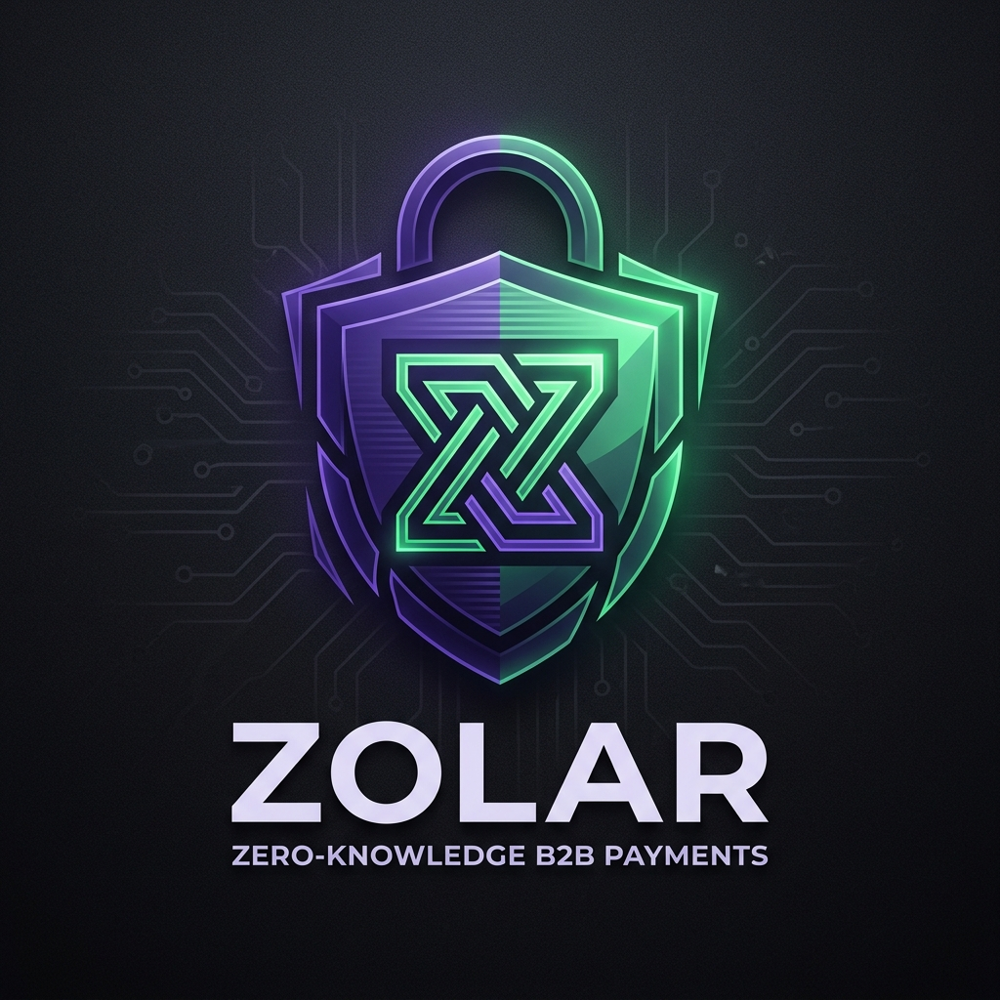

# ZKPay

<p align="center">
  
</p>

> **Colosseum Hackathon Submission** — Fiat payments → ZK-verifiable on-chain escrow on Solana

[](https://explorer.solana.com)
[](https://dodopayments.com)
[](https://github.com/iden3/snarkjs)
[](LICENSE)

---

## Overview

**ZKPay** is a programmable escrow system that bridges fiat credit card payments (via Dodo Payments) with zero-knowledge proofs and Solana smart contracts. A payer locks USDC into a Solana PDA escrow, and the recipient can only release it by providing a ZK proof that their service met the agreed SLA threshold — without ever revealing the raw metric.

```
Payer (credit card) → Dodo Payments → Webhook → Solana PDA escrow
                                                     ↓
Recipient provides ZK proof (uptime ≥ threshold) → Funds released
```

---

## Architecture

```
┌─────────────────────────────────────────────────────────────────┐
│  Frontend (React + Vite)         Backend (Node + Express)        │
│  ┌──────────────────┐            ┌───────────────────────────┐   │
│  │  Landing Page    │            │  POST /api/payment/create │   │
│  │  Payer Dashboard │◄──────────►│  GET  /api/payment/status │   │
│  │  Recipient Dash  │            │  POST /api/proof/generate │   │
│  │  Commitment Gen  │            │  POST /api/release        │   │
│  │  Status Checker  │            │  POST /webhook/dodo       │   │
│  └──────────────────┘            │  GET  /api/sla/commit     │   │
└─────────────────────────────────────────────────────────────────┘
         │                                    │
         │                          ┌─────────▼──────────┐
         │                          │  Solana Testnet     │
         │                          │  Anchor Program     │
         │                          │  (escrow.so)        │
         │                          └─────────────────────┘
         │
         └──► Dodo Payments (Fiat → Webhook → Escrow)
```

### Tech Stack

| Layer | Technology |
|-------|-----------|
| Frontend | React 18, Vite, Vanilla CSS |
| Backend | Node.js, Express |
| Blockchain | Solana (Testnet), Anchor Framework |
| ZK Proofs | snarkjs, Groth16, Poseidon hash, Circom |
| Payments | Dodo Payments (Test Mode) |
| Database | SQLite (better-sqlite3) |

---

## Features

- **Fiat → On-chain Escrow**: Pay with a credit card. Funds automatically locked into a Solana PDA via webhook.
- **ZK-Verifiable SLA**: Recipients prove they met an uptime threshold without revealing actual data (Poseidon commitment, Groth16 proof).
- **Dual Commitment Flow**: Payer pastes the recipient's commitment hash — payer never sees the raw SLA value.
- **Live Polling**: Frontend polls the backend status endpoint and shows escrow confirmation in real-time.
- **UptimeRobot Integration**: Recipient dashboard fetches real uptime data and generates a ZK commitment.
- **Demo Mode**: Built-in test data filling for rapid hackathon demos.

---

## Payment Flow

```
1. Recipient → generates Poseidon commitment from real uptime data
2. Recipient → shares commitment hash with Payer (opaque — no data revealed)
3. Payer    → fills form (amount, threshold, commitment) → clicks "Lock Payment"
4. Backend  → creates Dodo checkout session, stores localId + commitment in SQLite
5. Payer    → completes fiat payment (test card: 4242 4242 4242 4242)
6. Dodo     → fires payment.succeeded webhook → Backend verifies signature
7. Backend  → creates Solana escrow PDA via Anchor, stores in DB + demo-state.json
8. Frontend → poller detects "confirmed" status → shows escrow PDA + Tx hash
9. Recipient → generates Groth16 proof, submits to /api/release
10. Backend → verifies ZK proof on-chain → releases USDC to recipient
```

---

## Project Structure

```
zk-b2b-payments/
├── backend/
│   ├── src/
│   │   ├── index.js              # Express server + Dodo webhook handler
│   │   ├── services/
│   │   │   ├── dodo.js           # Dodo Payments API + SQLite persistence
│   │   │   ├── solana.js         # Anchor escrow initialization & release
│   │   │   └── zk.js             # snarkjs Groth16 proof + Poseidon hash
│   │   └── routes/
│   │       ├── payment.js        # /api/payment/* (create, status)
│   │       ├── proof.js          # /api/proof/generate
│   │       ├── release.js        # /api/release
│   │       └── sla.js            # /api/sla/commit (UptimeRobot integration)
│   └── .env.example
├── frontend/
│   ├── src/
│   │   ├── App.jsx               # Router + state management
│   │   ├── App.css               # Full design system
│   │   ├── pages/
│   │   │   ├── Landingpage.jsx
│   │   │   ├── PayerDashboard.jsx
│   │   │   ├── RecipientDashboard.jsx
│   │   │   ├── CommitmentGenerator.jsx
│   │   │   └── StatusChecker.jsx
│   │   ├── components/
│   │   │   ├── TxTimeline.jsx
│   │   │   └── DemoMode.jsx
│   │   └── utils/api.js
│   └── vite.config.js
├── program/                      # Anchor smart contract (Rust)
│   └── src/lib.rs
└── zk/
    ├── circuits/threshold.circom
    ├── build/                    # threshold.wasm
    └── keys/                     # threshold_final.zkey, verification_key.json
```

---

## Getting Started

### Prerequisites

- Node.js ≥ 18
- [Dodo Payments account](https://app.dodopayments.com) (free test mode)
- [Solana CLI](https://docs.solana.com/cli/install-solana-cli-tools) + funded testnet wallet
- [Anchor CLI](https://www.anchor-lang.com/docs/installation) (for contract deployment)
- [Dodo CLI](https://docs.dodopayments.com/developer-tools/webhooks/local-testing) (for local webhook tunnel)

### 1. Clone & Install

```bash
git clone https://github.com/Franklin1312/ZK-Powered-Programmable-B2B-Payments-Using-Dodo-Payments-on-Solana.git
cd zk-b2b-payments

# Install backend dependencies
cd backend && npm install

# Install frontend dependencies
cd ../frontend && npm install
```

### 2. Configure Environment

Copy `backend/.env.example` to `backend/.env` and fill in:

```env
PORT=3001
NODE_ENV=development

# Solana
SOLANA_RPC=https://api.testnet.solana.com
PROGRAM_ID=<your_deployed_program_id>
PAYER_PRIVATE_KEY=[...]      # Backend treasury keypair (JSON array)
RECIPIENT_PRIVATE_KEY=[...]  # Recipient keypair (JSON array)
USDC_MINT=<testnet_usdc_mint>

# Dodo Payments (get from https://app.dodopayments.com → Developers → API Keys)
DODO_PAYMENTS_API_KEY=<your_dodo_api_key>
DODO_PAYMENTS_WEBHOOK_KEY=<from_dodo_wh_listen_terminal>
DODO_PRODUCT_ID=<your_product_id>

# Frontend
FRONTEND_URL=http://localhost:5000
```

### 3. Run Locally

```bash
# Terminal 1 — Backend
cd backend
node src/index.js

# Terminal 2 — Frontend
cd frontend
npm run dev

# Terminal 3 — Dodo webhook tunnel (copy the whsec_ secret into .env)
dodo wh listen --forward-to http://localhost:3001/webhook/dodo
```

Open [http://localhost:5000](http://localhost:5000).

### 4. Test Payment

Use Dodo's test cards:

| Region | Card | Exp | CVV |
|--------|------|-----|-----|
| Global (USD) | `4242 4242 4242 4242` | 06/32 | 123 |
| India (INR) | `4576 2389 1277 1450` | 06/32 | 123 |

---

## Deployment

### Render (Backend)

| Setting | Value |
|---------|-------|
| Root Directory | `backend` |
| Build Command | `npm install` |
| Start Command | `node src/index.js` |

**Environment Variables** to set in Render Dashboard:
- All variables from `.env` above (except `FRONTEND_URL` — set to your Vercel URL)
- `DODO_PAYMENTS_WEBHOOK_KEY` — use the **Signing Secret** from Dodo Dashboard (not the CLI tunnel secret)

**Webhook URL** to register in Dodo Dashboard:
```
https://<your-render-app>.onrender.com/webhook/dodo
```

### Vercel (Frontend)

| Setting | Value |
|---------|-------|
| Root Directory | `frontend` |
| Build Command | `npm run build` |
| Output Directory | `dist` |

**Environment Variables:**
```
VITE_API_URL=https://<your-render-app>.onrender.com/api
```

---

## ZK Circuit

The threshold circuit (`zk/circuits/threshold.circom`) proves:

```
Poseidon(privateValue, salt) == commitment  AND  privateValue >= threshold
```

- **Private inputs**: `privateValue` (real uptime %), `salt` (random nonce)
- **Public inputs**: `commitment` (stored on-chain), `threshold` (agreed SLA)
- **Proof system**: Groth16 (snarkjs)
- **Hash function**: Poseidon (ZK-friendly, on-chain verifiable)

The recipient's actual uptime value is **never revealed** — only the proof that it meets the threshold.

---

## Smart Contract

The Anchor program (`program/src/lib.rs`) exposes two instructions:

| Instruction | Description |
|-------------|-------------|
| `initialize_escrow` | Creates a PDA with locked amount, threshold, and Poseidon commitment |
| `release_payment` | Verifies Groth16 proof on-chain; releases USDC to recipient if valid |

PDA seeds: `["escrow", payer_pubkey, sha256(payment_ref)]`

---

## Known Limitations (Local Dev)

- **Webhook secret rotation**: `dodo wh listen` generates a new `whsec_` secret each run — update `DODO_PAYMENTS_WEBHOOK_KEY` in `.env` and restart the backend after restarting the tunnel.
- **SQLite is ephemeral**: Restarting the backend clears in-memory state. Use `demo-state.json` fallback for cross-restart status polling.
- **Currency conversion**: Dodo's test mode may apply local taxes (INR). The backend always uses the original USD amount from the database to create the escrow.

---

## License

MIT © Franklin Babu — Colosseum Hackathon 2025
